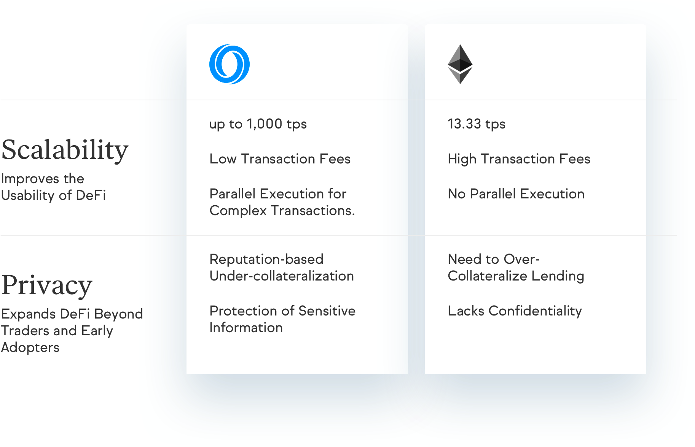

# Run a ParaTime Node

The Oasis Network has two main components, the Consensus Layer and the ParaTime Layer.

1. The **Consensus Layer** is a scalable, high-throughput, secure, proof-of-stake consensus run by a decentralized set of validator nodes.
2. The **ParaTime Layer** hosts many parallel runtimes (ParaTimes), each representing a replicated compute environment with shared state.

\
Operating a ParaTime requires the participation of node operators, who contribute nodes to the committee in exchange for rewards. ParaTimes can be operated by anyone, and have their own reward system, participation requirements, and structure.

As a node operator you can participate in any number of ParaTimes. While there are a number of ParaTimes under development, below are a few key ParaTimes that you can get involved in today. For operational documentation on running a ParaTime, please see the section on [running a ParaTime node for node operators](../run-a-node/set-up-your-node/run-a-paratime-node.md).



### Cipher ParaTime

An Oasis Foundation developed ParaTime that will enable WebAssembly-based confidential smart contracts.

### Overview&#x20;

* **Leading Developer: **[Oasis Protocol Foundation](http://oasisprotocol.org)
* **Status: **Deployed on Mainnet and Testnet
* **Tesnet Launch Date: **June 2021
* **Mainnet Launch Date: **October 2021
* **Slack Channel: **[**#**cipher-paratime](../oasis-network/connect-with-us.md#social-media-channels)
* **Requires SGX**: Yes
* **Parameters:**
  * [Mainnet](../oasis-network/network-parameters.md#cipher-paratime)
  * [Testnet](../foundation/testnet/#cipher-paratime)

### Features

* Fully decentralized with node operators distributed across the world.
* Oasis **ROSE **tokens will be the native token used in the ParaTime for gas fees.
* Support for WebAssembly smart contracts.
* Support for confidential compute.

### Rewards

* The ParaTime will release tokens on-chain to reward nodes for participation.
* The reward program is 2 years long, and tokens will be released per epoch.
* The reward will be 10\~20 ROSE tokens per entity per epoch, where the Oasis Protocol Foundation will make the final decision on the reward size upon the Cipher's Mainnet launch.
* Incentivized Testnet with ROSE tokens delegated by the Oasis Protocol Foundation to Testnet participants based on performance (rewards can be found [here](https://oasis-foundation.medium.com/oasis-cipher-paratime-c9f40ae64946)).



### Emerald ParaTime

An EVM-compatible Oasis Foundation developed ParaTime that enables the use of EVM smart contracts on the Oasis network.

### Overview

* **Leading Developer:** [Oasis Protocol Foundation](https://oasisprotocol.org), with contributions from community developers
* **Status:** Deployed on Testnet
* **Testnet Launch Date:** October 2021
* **Mainnet Launch Date:** November 2021
* **Slack Channel:** [**#**emerald-paratime](../oasis-network/connect-with-us.md#social-media-channels)
* **Requires SGX:** No
* **Parameters:**
  * [Testnet](../foundation/testnet/#emerald-paratime)

### Features

* Fully decentralized with node operators distributed across the world.
* Oasis **ROSE** tokens will be the native token used in the ParaTime for gas fees.



Oasis Lab's Parcel ParaTime is also under development. If you're a developer and would like to start building applications on the Oasis Network with the Parcel SDK please sign up [here](https://www.oasislabs.com/parcelsdk).
