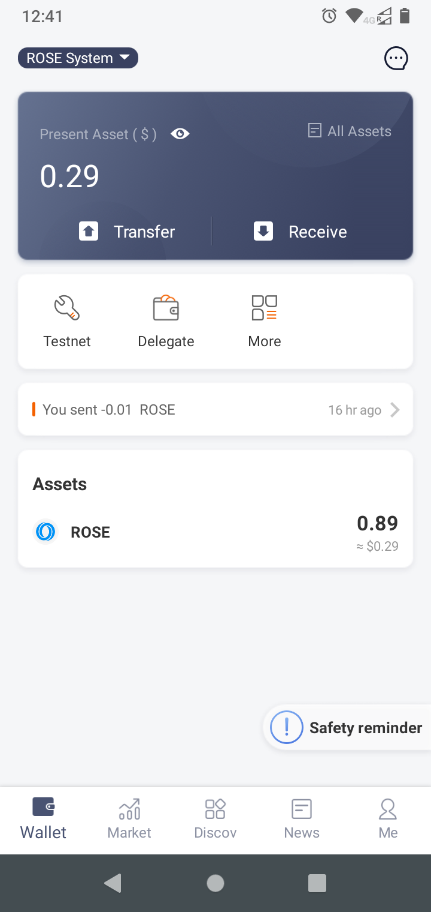

# Frequently Asked Questions

### How can I transfer ROSE tokens from my [BitPie wallet](holding-rose-tokens/bitpie-wallet.md) to my Oasis Wallet?


BitPie wallet doesn't use the standardized account key generation process specified in [ADR 0008](https://github.com/oasisprotocol/oasis-core/blob/master/docs/adr/0008-standard-account-key-generation.md). Consequently, your **Bitpie wallet's mnemonic phrase will not open the same account in Oasis Wallet**.


The **preferred way** is to create a new wallet with an Oasis Wallet and transfer the tokens to this new address using your BitPie wallet. The cost (i.e. transaction fee) should be negligible.

If your tokens are staked/delegated, then you need to debond them first which will take approximately 14 days. Afterwards, you can transfer them to the new Oasis Wallet address and stake/delegate them via an Oasis Wallet again.

**Alternatively** however, if you do not want to transfer the tokens over the network, you can export the private key from your BitPie wallet and import it in Oasis Wallet in 2 steps:

* [Export your BitPie wallet's Oasis account private key](faq.md#how-can-i-export-my-bitpie-wallets-oasis-account-private-key)
* [Open your Oasis wallet via exported private key in Oasis Wallet - Web](https://docs.oasis.dev/general/manage-tokens/oasis-wallets/web#open-wallet-via-private-key)

### How can I export my [BitPie wallet](holding-rose-tokens/bitpie-wallet.md)'s Oasis account private key?

On the main BitPie wallet screen, click on the "Receive" button.

The QR code with your ROSE address will appear. Then, in the top right corner, tap on the kebab menu "⋮" and select "Display Private Key"_._

BitPie wallet will now ask you to enter your PIN to access the private key.

Finally, your account's private key will be shown to you encoded in Base64 format (e.g. `YgwGOfrHG1TVWSZBs8WM4w0BUjLmsbk7Gqgd7IGeHfSqdbeQokEhFEJxtc3kVQ4KqkdZTuD0bY7LOlhdEKevaQ==`) which you can [import into Oasis Wallet](oasis-wallets/web.md#access-an-existing-wallet).

### Can I use my Oasis Wallet mnemonics in Ledger?

Yes. Starting from Oasis app for Ledger v2.3.1 a standardized key derivation path as defined in [ADR 8](https://github.com/oasisprotocol/oasis-core/blob/master/docs/adr/0008-standard-account-key-generation.md) is supported. You can import the same mnemonics used by the Oasis Wallet - Web and Chrome extension to Ledger. Ledger will then generate the same Oasis wallet address and can be used to sign transactions and send funds.


Versions of Oasis app for Ledger prior to v2.3.1 used a non-standard key derivation path. Mnemonics could be imported to Ledger, but the generated wallet address and the private key used to send your funds would be invalid.


&#x20;derivation path standardized in . This derivation path is also .

Note that previous versions of Oasis app for Ledger used a different derivation path and importing of mnemonics was not possible.
