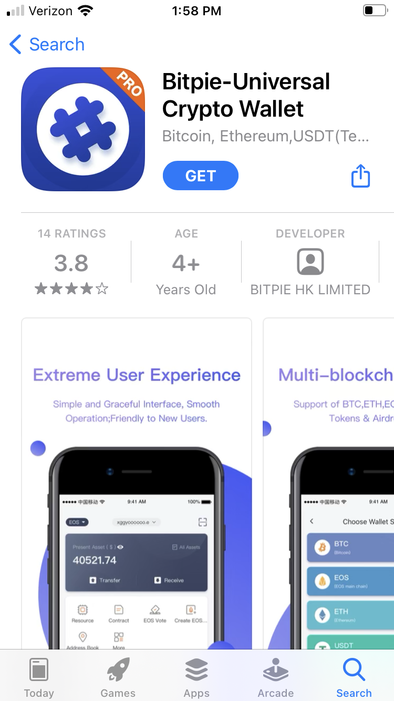
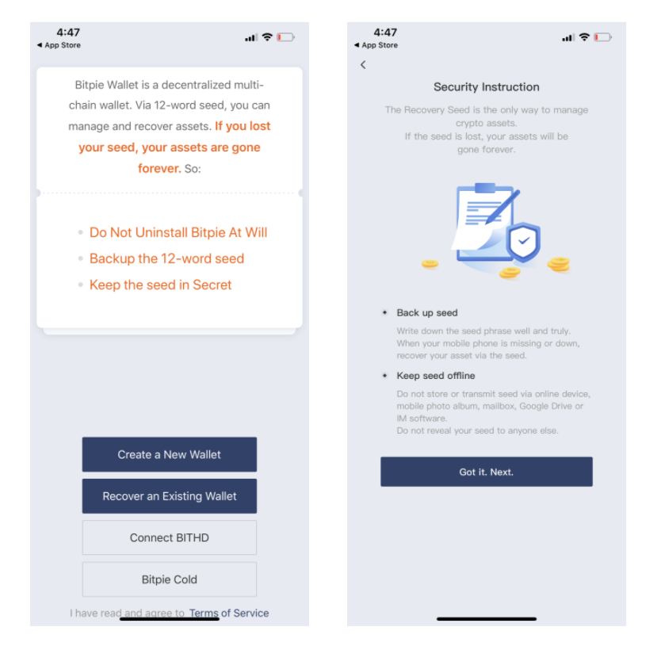
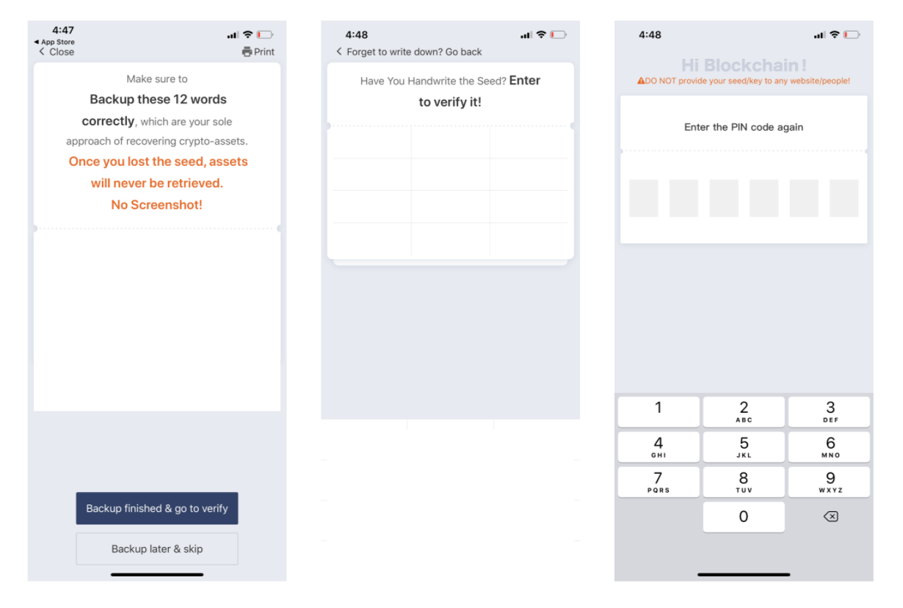
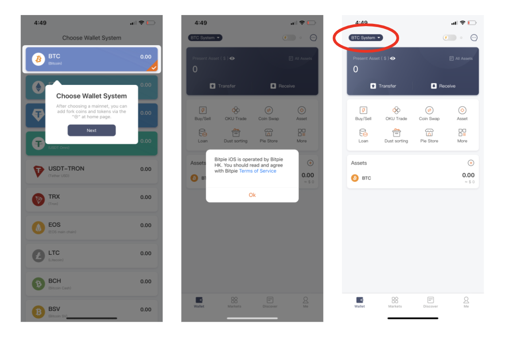
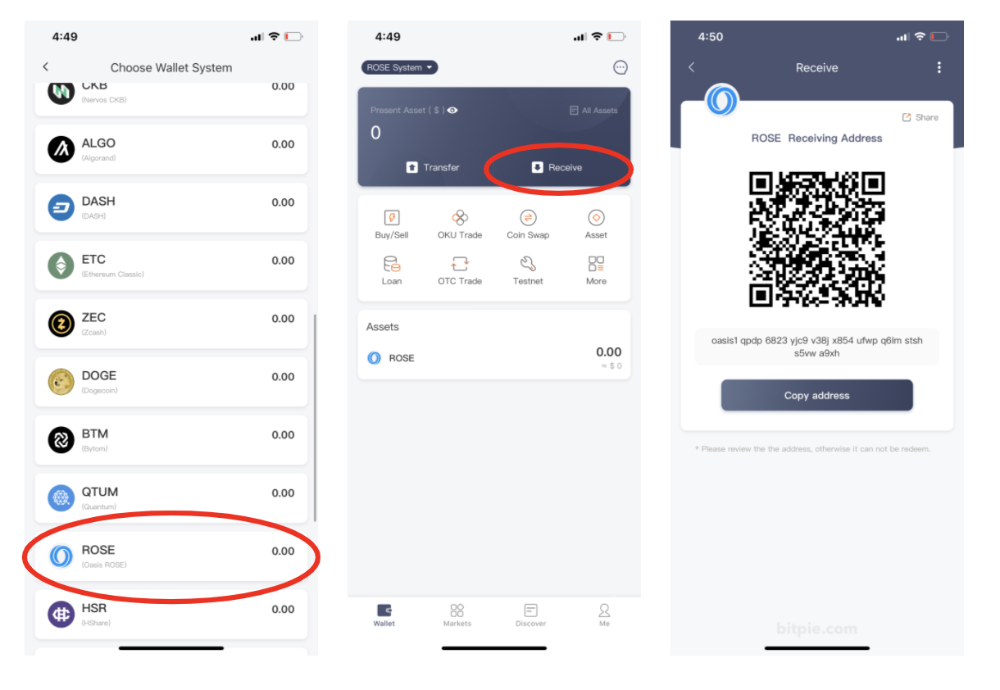
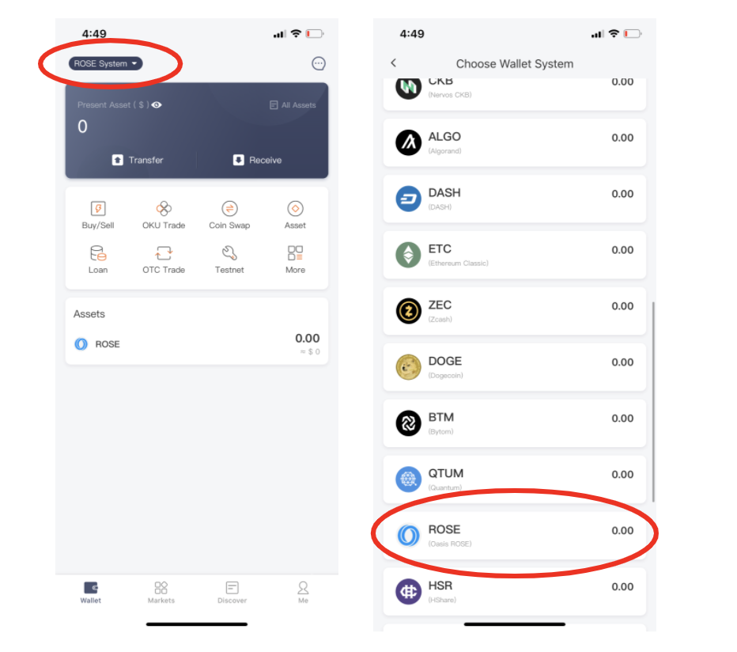
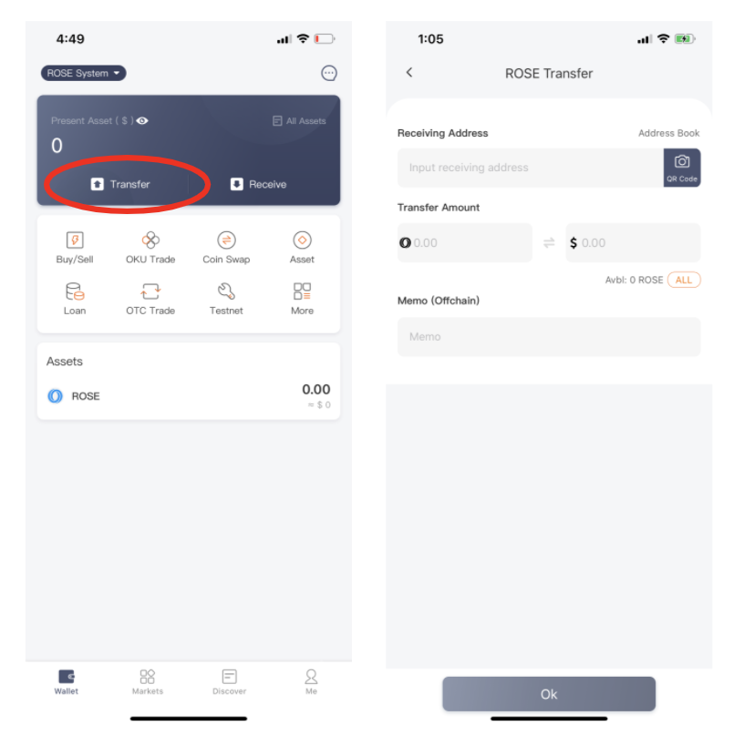

# Bitpie Wallet Guide

## What is Bitpie?

Bitpie is a safe and user-friendly crypto wallet app available on mobile devices. The Bitpie Wallet lets you generate an Oasis wallet address so that you can receive ROSE tokens, as well as transfer out ROSE tokens to other valid Oasis wallet addresses. In addition to letting you manage your ROSE tokens for use on the Oasis Network, the Bitpie Wallet is also compatible with many other crypto assets, including BTC, ETH, and USDT, so it can serve as a one-stop shop for many of your crypto management needs. \
\
The Bitpie team is an official partner of the Oasis Protocol Foundation, so you can be sure that the Bitpie Wallet is secure and up-to-date with the latest Oasis Network integrations.&#x20;


For your own security and peace of mind, please only use wallet apps that are listed on our official documentation. Any other wallet apps are likely unofficial and may be subject to criticial security vulnerabilities and other technical issues. Using wallet apps that not listed in our official documentation could result in the permanent loss of your ROSE token assets.&#x20;



BitPie Wallet currently only supports address generation and transfer functionality on the Oasis Mainnet. Staking and delegation functionality is currently disabled but in development.&#x20;


## Installation

To install the Bitpie Wallet, you need an iOS or Android device. \
\
If you have an iOS device, visit [the App Store](https://apps.apple.com/us/app/bitpie-universal-crypto-wallet/id1481314229), and click "Get" to download the Bitpie app. You may see multiple Bitpie apps listed -- make sure you select the app named **Bitpie-Universal Crypto Wallet**.&#x20;

If you have an Android device, [visit the Google Play Store](https://play.google.com/store/apps/details?id=com.bitpie), and clicke "Install" to download the Bitpie app.

If you are not able to find the Bitpie app in your respective app marketplace or encounter installation issues, your device may have an operating system version that is not supported by the Bitpie app. Check the app download page to see what operating system versions the Bitpie app is compatible with.&#x20;

## Generate Your Oasis Wallet Address

After you have successfully installed the Bitpie app on your device, open it to get started with generating your Oasis wallet address. Click on the "Creat a New Wallet" button. This will take you to a Security Instruction page -- make sure you read through the content of that page, and click the "Got it. Next." button.

You will be shown 12 words that will serve as the "seed phrase" that you can use to recover your account at a later point. Make sure you write down or store these 12 words in a secure location in the same order that they are displayed on the screen.&#x20;


Make sure you write down or store the 12 words your "seed phrase" in a secure location. If you lose this seed, you may permanently lose your assets.&#x20;


After you have written down or stored the 12 words in your seed, click on the 'Backup finished & go to verify" button.&#x20;

On the next screen, refer to your written down or stored seed and tap the words in the appropriate order to verify your account. \
\
Next, you will be asked to create a 6-digit pin. Type in a pin of your choice. Make sure that you can remember this pin later, but that it is not easy for others to guess or retrieve. You may be asked to type in your pin again in order to verify it.&#x20;

After setting up your pin, you may see some tutorial captions appear on screen. Tap the "Next" button to go through these. You may need to tap through some additional messages and prompts.\
\
Next you should see a screen like the one below, showing your assets for BTC or another network. Click on the "BTC System" (or other network) button with the drop down arrow on the top left corner of the screen to go to the list of crypto assets supported by Bitpie.&#x20;

On the screen displaying the list of supported cryptocurrency assets, scroll down until you find ROSE, labelled with the blue "O" logo and the words "ROSE (Oasis ROSE)." \
\
Next, you should see a screen like the one below, labelled "ROSE System" in the top left corner of the screen and displaying "ROSE" under the "Assets" section. \
\
To view your newly generated Oasis wallet address, lick on the "Receive" button. You should then see a screen displaying a QR CODE and your Oasis wallet address, which is an alphanumeric string beginning with "oasis".&#x20;

Congratulations! You have generated your very own Oasis wallet address. You can share this Oasis wallet address publicly to receive ROSE tokens from others, and you can use your Bitpie Wallet to transfer your ROSE tokens to others as well.&#x20;

## Transfer ROSE Tokens

After you've successfully installed the Bitpie Wallet app on your device and generated an Oasis wallet address for yourself, if you have a positive ROSE token balance on your account, you can transfer ROSE tokens to other valid Oasis wallet addresses. \
\
To transfer ROSE tokens, make sure you are under the "ROSE System" in the "Wallet" tab. If you are not in the "ROSE System" interface, you need to click on the button on the top left corner of the screen and scroll through the list of supported cryptocurrency assets to select "ROSE".

On the "ROSE System" interface, click on the "Transfer" button. This takes you to the "ROSE Transfer" screen. You need to enter a valid Oasis wallet address, which you can do manually, or by scanning a QR code with your device's camera. You can set the transfer amount in ROSE, as well as add an off-chain memo message for your own reference. After you have added all of the necessary information for your transfer, click on the "OK" button to proceed.


For additional troubleshooting and to provide any feedback on your Bitpie Wallet experience, please reach out to the Bitpie team directly at **support@bitpie.com **or via [their website](https://www.bitpiehk.com).


